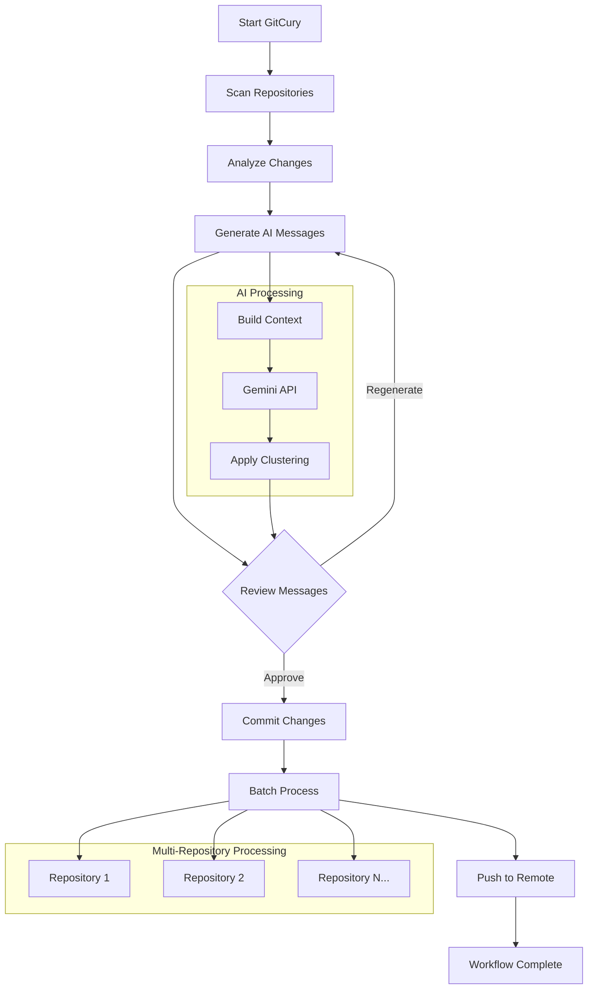
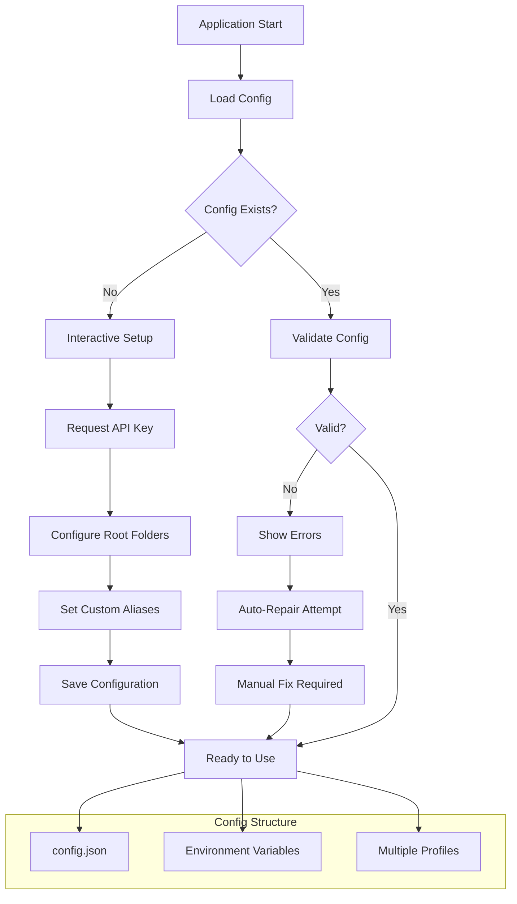
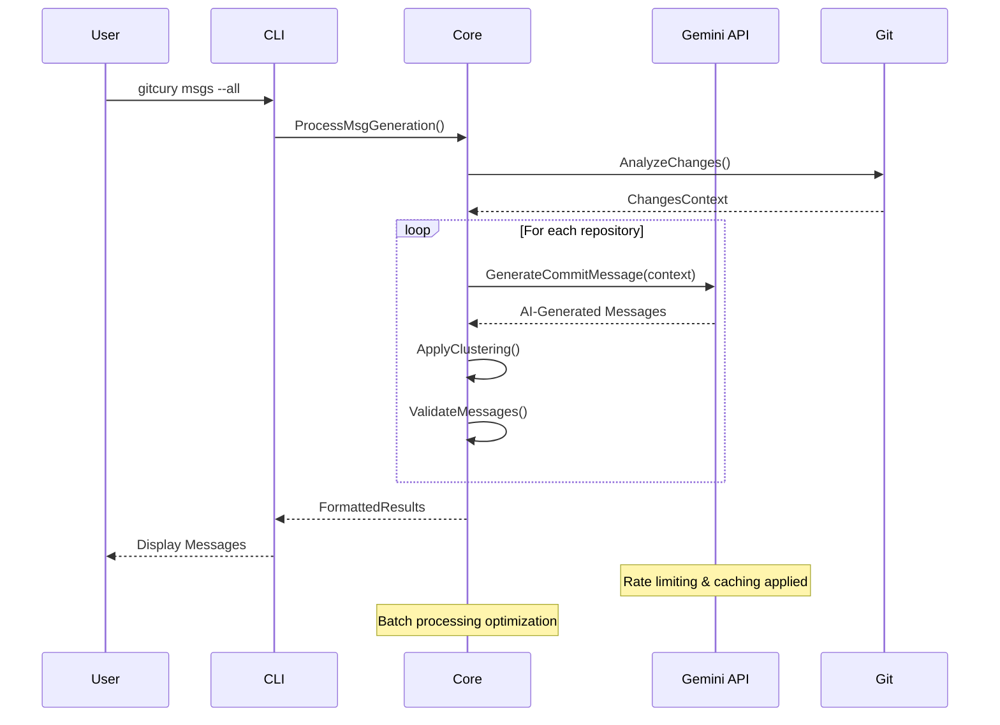
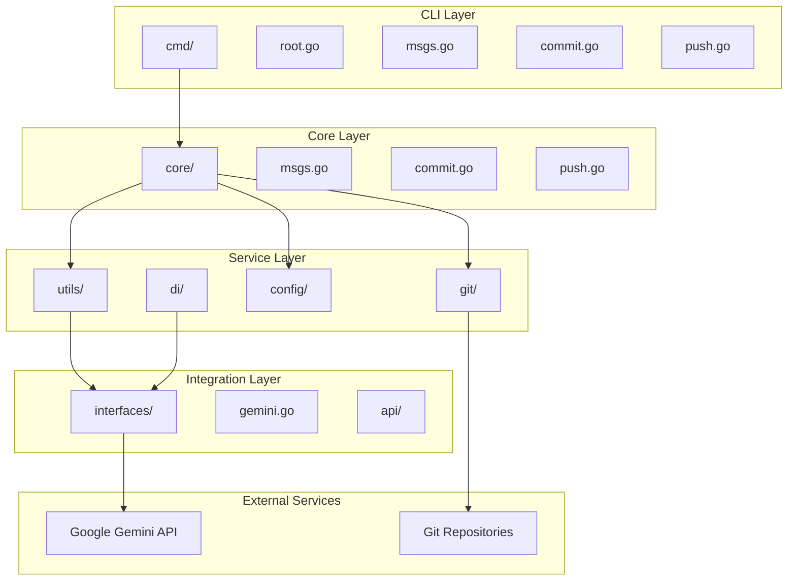
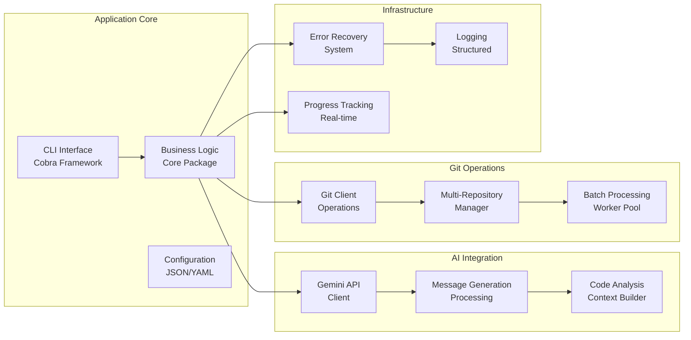
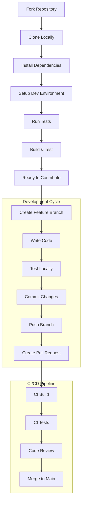

# GitCury

<div align="center">

```
██████╗ ██╗████████╗ ██████╗██╗   ██╗██████╗ ██╗   ██╗
██╔════╝ ██║╚══██╔══╝██╔════╝██║   ██║██╔══██╗╚██╗ ██╔╝
██║  ███╗██║   ██║   ██║     ██║   ██║██████╔╝ ╚████╔╝ 
██║   ██║██║   ██║   ██║     ██║   ██║██╔══██╗  ╚██╔╝  
╚██████╔╝██║   ██║   ╚██████╗╚██████╔╝██║  ██║   ██║   
 ╚═════╝ ╚═╝   ╚═╝    ╚═════╝ ╚═════╝ ╚═╝  ╚═╝   ╚═╝   
```

**⚡ Your AI-Powered Git Assistant**

*Transform your Git workflow with intelligent automation and AI-generated commit messages*

[](https://golang.org/dl/)
[](https://github.com/lakshyajain-0291/GitCury/releases)
[](./LICENSE)
[](https://goreportcard.com/report/github.com/lakshyajain-0291/GitCury)
[](https://hub.docker.com/r/lakshyajain1503/gitcury)
[](https://github.com/lakshyajain-0291/GitCury/actions)

[✨ Features](#features) • [🚀 Quick Start](#quick-start) • [📖 Documentation](#documentation) • [🤝 Contributing](#contributing)

</div>

---

## ✨ Features

GitCury revolutionizes your Git workflow by combining the power of AI with seamless automation:

- 🧠 **AI-Powered Commit Messages** - Generate meaningful commit messages using Google Gemini API
- 🎯 **Multi-Repository Management** - Handle multiple repositories effortlessly from a single interface
- ⚡ **Batch Operations** - Process commits, pushes, and messages across all your projects at once
- 🛡️ **Smart Error Recovery** - Robust error handling with detailed diagnostics and recovery suggestions
- 🎨 **Beautiful CLI** - Intuitive command-line interface with rich output formatting
- 🐳 **Docker Ready** - Full containerization support for consistent environments
- 📊 **Progress Tracking** - Real-time progress indicators for all operations
- 🔧 **Highly Configurable** - Extensive configuration options to match your workflow
- 🔄 **Grouping and Clustering** - Automatically group related changes for better commit organization
- ⚙️ **Parallelism** - Leverage multi-threaded processing for faster operations across repositories

## 🚀 Quick Start

### Installation

<details>
<summary><strong>📦 Package Managers (Recommended)</strong></summary>

#### Homebrew (macOS & Linux)
```bash
brew tap lakshyajain-0291/gitcury
brew install gitcury
```

#### Scoop (Windows)
```powershell
scoop bucket add gitcury https://github.com/lakshyajain-0291/GitCury-Scoop-Bucket.git
scoop install gitcury
```

#### Go Install
```bash
go install github.com/lakshyajain-0291/gitcury@latest
export PATH=$PATH:$(go env GOPATH)/bin
gitcury -h
```

</details>

<details>
<summary><strong>🐳 Docker</strong></summary>

```bash
# Pull the latest image
docker pull lakshyajain1503/gitcury:latest
```
To use gitcury like a native command:
```bash
# Run GitCury in a container
sudo tee /usr/local/bin/gitcury > /dev/null << 'EOF'
#!/bin/bash
docker run -it --rm \
  -v "\$(pwd):/app/data" \
  -v "\$HOME/.gitconfig:/home/gitcuryuser/.gitconfig:ro" \
  -v "\$HOME/.gitcury:/home/gitcuryuser/.gitcury" \
  lakshyajain1503/gitcury:latest "\$@"
EOF

sudo chmod +x /usr/local/bin/gitcury
```

</details>

<details>
<summary><strong>📥 Direct Download</strong></summary>

Download pre-built binaries from our [releases page](https://github.com/lakshyajain-0291/GitCury/releases/latest) for:
- Linux (x86_64, ARM64)
- macOS (Intel, Apple Silicon)
- Windows (x86_64, ARM64)

</details>

### Initial Setup

1. **Get your Gemini API key** (free) from [Google AI Studio](https://aistudio.google.com/app/apikey)

2. **Configure GitCury**:
```bash
gitcury setup
gitcury config set --key GEMINI_API_KEY --value YOUR_API_KEY_HERE
```

3. **Add your project directories**:
```bash
gitcury config set --key root_folders --value "/path/to/your/projects,/path/to/other/projects"
```

4. **Verify setup**:
```bash
gitcury config check
```

## 🎯 Usage

### Core Commands

Generate AI-powered commit messages:
```bash
# For all repositories
gitcury getmsgs --all

# For specific repository
gitcury getmsgs --root /path/to/repo

# Generate multiple message options
gitcury getmsgs --all --num 3

#Generate messages while grouping files into clusters
gitcury getmsgs --all -g

#Generate messages while grouping files into specific number of clusters
gitcury getmsgs --all -g --num 3
```

Change the Clustering Default Method
```bash
# For Directory based Clustering
gitcury config set --key defaultMethod --value directory

# For pattern based Clustering
gitcury config set --key defaultMethod --value pattern

# For semantic (embedding based) Clustering
gitcury config set --key defaultMethod --value semantic
```

Commit with generated messages:
```bash
# Commit all changes across repositories
gitcury commit --all

# Commit changes in specific repository
gitcury commit --root /path/to/repo
```

Push changes:
```bash
# Push all repositories
gitcury push --all

# Push specific repository
gitcury push --root /path/to/repo
```

### Workflow Examples

<details>
<summary><strong>🔄 Complete Workflow Automation</strong></summary>

**Workflow Visualization:**



```bash
# 1. Generate commit messages for all projects
gitcury msgs --all --num 2

# 2. Review and commit changes
gitcury commit --all

# 3. Push all changes
gitcury push --all
```

**Process Flow:**
1. **Analysis** - GitCury scans all configured repositories
2. **AI Generation** - Gemini API creates contextual commit messages
3. **Review** - User reviews generated messages
4. **Batch Commit** - All repositories committed simultaneously
5. **Push** - Changes pushed to remote repositories

</details>

<details>
<summary><strong>🎯 Single Repository Workflow</strong></summary>

```bash
# Navigate to your project
cd /path/to/your/project

# Generate commit messages
gitcury msgs --root .

# Commit with AI-generated message
gitcury commit --root .

# Push changes
gitcury push --root .
```

</details>

<details>
<summary><strong>⚡ Express Mode</strong></summary>

```bash
# One-liner for quick commits (using aliases)
gitcury msgs --all && gitcury commit --all && gitcury push --all
```

</details>

## 📖 Documentation

| Document | Description |
|----------|-------------|
| [🔧 Development Guide](./DEVELOPMENT.md) | Setup development environment and contribution guidelines |
| [📋 Release Guide](./RELEASE_GUIDE.md) | Complete release process and versioning information |
| [🔄 Versioning Strategy](./VERSIONING.md) | Semantic versioning and release strategy |
| [📊 Test Coverage Report](./COVERAGE_REPORT.md) | Comprehensive testing metrics and coverage analysis |
| [📊 Performance Report](./PERFORMANCE_REPORT.md) | Comprehensive performance metrices of all grouping methods|

### Advanced Configuration

<details>
<summary><strong>⚙️ Configuration Options</strong></summary>

**Configuration Flow:**



GitCury supports extensive configuration through `~/.gitcury/config.json`:

```json
{
  "gemini_api_key": "your-api-key",
  "root_folders": ["/path/to/project1", "/path/to/project2"],
  "default_commit_count": 3,
  "auto_push": false,
  "clustering": {
    "enabled": true,
    "similarity_threshold": 0.8
  },
  "aliases": {
    "commit": "seal",
    "push": "deploy",
    "msgs": "getmsgs"
  }
}
```

**Key Configuration Features:**
- 🎛️ **Clustering** - Group similar changes for better commit organization
- 🚀 **Auto-push** - Automatically push after successful commits
- 📝 **Custom Aliases** - Personalize command names to match your workflow
- 🎯 **Smart Defaults** - Sensible defaults that work out of the box

**Configuration Management:**
- **Validation** - Automatic configuration validation on startup
- **Migration** - Seamless config updates between versions
- **Environment Variables** - Override settings via environment variables
- **Multiple Profiles** - Support for different configuration profiles

</details>

<details>
<summary><strong>🔌 API Integration</strong></summary>

**AI Integration Flow:**



GitCury integrates with Google Gemini API for intelligent commit message generation:

- **Contextual Analysis** - Analyzes code changes to understand intent
- **Multiple Options** - Generates several commit message variations
- **Best Practices** - Follows conventional commit standards
- **Smart Categorization** - Automatically detects feature, fix, docs, etc.

**Integration Features:**
- **Rate Limiting**: Intelligent API call management
- **Error Handling**: Graceful fallbacks and retry mechanisms  
- **Caching**: Optimized performance with response caching
- **Batch Processing**: Efficient handling of multiple repositories

</details>

## 🏗️ Architecture

<details>
<summary><strong>📋 Project Structure</strong></summary>

```
GitCury/
├── cmd/                    # CLI commands and interface
├── core/                   # Core business logic
├── config/                 # Configuration management
├── git/                    # Git operations and integration
├── utils/                  # Utility functions and helpers
├── interfaces/             # Interface definitions
├── tests/                  # Comprehensive test suite
├── assets/                 # Project assets and documentation
└── docs/                   # Additional documentation
```

**System Architecture Diagram:**



The architecture follows a modular design with clear separation of concerns:
- **CLI Layer** (`cmd/`) - User interface and command handling
- **Core Layer** (`core/`) - Business logic and workflows
- **Service Layer** (`git/`, `utils/`) - Git operations and utilities
- **Integration Layer** (`interfaces/`) - External API integrations
- **Configuration Layer** (`config/`) - Settings and user preferences

</details>

<details>
<summary><strong>🔧 Technical Specifications</strong></summary>

**System Component Overview:**



**Technical Stack:**
- **Language**: Go 1.24+
- **CLI Framework**: Cobra
- **AI Integration**: Google Gemini API
- **Architecture**: Modular, dependency-injected design
- **Testing**: 15.5% integration coverage with end-to-end validation
- **Platforms**: Cross-platform (Linux, macOS, Windows)
- **Deployment**: Multi-channel distribution (Homebrew, Scoop, Docker, Direct)

**Key Components:**
- **Dependency Injection**: Clean architecture with interface-based design
- **Worker Pool**: Concurrent processing for multi-repository operations
- **Error Recovery**: Advanced error handling with context and suggestions
- **Progress Tracking**: Real-time feedback for long-running operations
- **Configuration Management**: Flexible JSON-based configuration system

</details>

## 🤝 Contributing

We welcome contributions! Here's how to get started:

<details>
<summary><strong>🚀 Quick Contribution Setup</strong></summary>

**Development Setup Flow:**



```bash
# 1. Fork and clone the repository
git clone https://github.com/your-username/GitCury.git
cd GitCury

# 2. Install dependencies
go mod download

# 3. Set up development environment
make install

# 4. Run tests
make test

# 5. Build and test locally
make build
./gitcury --help
```

</details>

### Development Workflow

1. **Fork** the repository
2. **Create** a feature branch (`git checkout -b feature/amazing-feature`)
3. **Commit** your changes (`git commit -m 'feat: add amazing feature'`)
4. **Push** to the branch (`git push origin feature/amazing-feature`)
5. **Open** a Pull Request

### Code Standards

- ✅ Follow Go best practices and idioms
- ✅ Add tests for new functionality
- ✅ Use conventional commit messages
- ✅ Ensure all CI checks pass
- ✅ Update documentation as needed

## 📊 Project Status

| Metric | Status |
|--------|--------|
| **Build Status** | [](https://github.com/lakshyajain-0291/GitCury/actions) |
| **Latest Release** |  |
| **Test Coverage** | 15.5% (Integration-focused) |
| **Go Version** | 1.24+ |
| **Platforms** | Linux, macOS, Windows |

## 🔗 Links

- 📊 [GitHub Repository](https://github.com/lakshyajain-0291/GitCury)
- 📦 [Docker Hub](https://hub.docker.com/r/lakshyajain1503/gitcury)
- 🍺 [Homebrew Tap](https://github.com/lakshyajain-0291/homebrew-gitcury)
- 🪣 [Scoop Bucket](https://github.com/lakshyajain-0291/GitCury-Scoop-Bucket)
- 🔑 [Get Gemini API Key](https://aistudio.google.com/app/apikey)

## 📄 License

This project is licensed under the MIT License - see the [LICENSE](./LICENSE) file for details.

## 🙏 Acknowledgments

- **Google Gemini API** - Powering our AI-driven commit message generation
- **Cobra CLI** - Excellent command-line interface framework
- **Go Community** - For the robust ecosystem and best practices
- **Contributors** - Everyone who has helped make GitCury better

---

<div align="center">

**⭐ Star us on GitHub** — it motivates us to keep improving GitCury!

*Made with ❤️ for developers who love efficient Git workflows*

</div>
