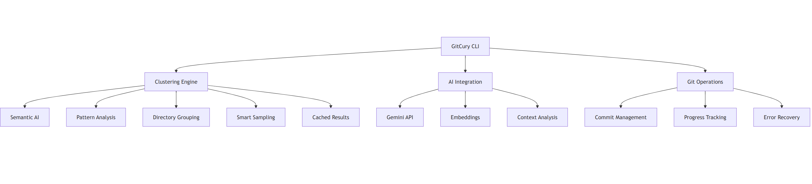

<div align="center">

# 🌟 GitCury: AI-Powered Git Automation 🚀

*Streamline Your Git Workflow with Intelligent Commit Messages*

[](https://go.dev/)
[](https://git-scm.com/)
[](https://gemini.google.com/)

[](https://vscode.dev/)
[](https://github.com/lakshyajain-0291/GitCury/graphs/contributors)
[](https://github.com/lakshyajain-0291/GitCury/network/members)
[](https://github.com/lakshyajain-0291/GitCury/stargazers)
[](https://goreportcard.com/report/github.com/lakshyajain-0291/GitCury)
[](https://opensource.org/licenses/MIT)

</div>

---

## 🎯 What is GitCury?

GitCury is an **AI-powered Git automation CLI tool** that streamlines your development workflow. Built with Go and powered by Google's Gemini AI, GitCury automates commit message generation, manages multi-repository operations, and provides intelligent Git workflow automation.

### 🧠 Core Intelligence

GitCury leverages **Google Gemini AI** to understand your code changes and generate meaningful commit messages automatically. It supports multi-repository workflows and provides a comprehensive CLI for managing Git operations across multiple project roots.

## ✨ Key Features

### 🤖 **AI-Powered Commit Messages**  
Let the Gemini API craft meaningful commit messages for you based on file changes. No more staring at your terminal in despair!

### 📂 **Multi-Repository Support**  
Configure multiple root folders to manage Git operations across different projects simultaneously. Perfect for monorepos and multi-project workflows!

### 📊 **Organized Output**  
Commit messages are neatly organized in `output.json` by root folder:
```json
{
  "folders": {
    "root_folder1": {
      "files": {
        "file1.go": "feat: implement user authentication",
        "file2.go": "fix: resolve login validation issue"
      }
    },
    "root_folder2": {
      "files": {
        "file3.py": "docs: update API documentation",
        "file4.py": "test: add unit tests for data processing"
      }
    }
  }
}
```

### ⚡ **Batch Operations**  
Perform Git operations across all root folders or focus on just one. Complete flexibility for your workflow!

### 🔑 **Alias-Based Commands**  
Use intuitive aliases like `seal` for commit, `deploy` for push, and `genesis` for generating commit messages. Fully customizable to suit your preferences.

### 🛠️ **Flexible Configuration**  
Easy configuration management through CLI commands or direct config file editing. Set API keys, root folders, file limits, and custom aliases.

### 📈 **Statistics Tracking**  
Track operation performance, success rates, and execution times with the global `--stats` flag for all commands.

### 🌊 **End-to-End Workflow**  
The `boom` command provides a complete workflow: generate messages → commit → push, all with interactive confirmations.

## 🚀 Quick Start & Installation

### 📋 **Prerequisites**
- **Go 1.19+** (for building from source)
- **Git** (obviously! 😄)
- **Gemini API Key** (for AI-powered features)
- **Optional**: Machine Learning libraries for advanced clustering

### ⚡ **Installation Methods**

<details>
<summary><b>🔧 Method 1: Build from Source (Recommended)</b></summary>

1. **Clone the repository:**
   ```bash
   git clone https://github.com/lakshyajain-0291/GitCury.git
   cd GitCury
   ```

2. **Install dependencies:**
   ```bash
   go mod tidy
   ```

3. **Build with optimizations:**
   ```bash
   # Standard build
   go build -o gitcury main.go
   
   # Optimized build with AI features
   go build -ldflags="-s -w" -o gitcury main.go
   ```

4. **Verify installation:**
   ```bash
   ./gitcury --version
   ./gitcury --help
   ```

</details>

<details>
<summary><b>🐳 Method 2: Docker (Coming Soon)</b></summary>

```bash
# Pull the latest image
docker pull lakshyajain0291/gitcury:latest

# Run with volume mounting
docker run -v $(pwd):/workspace lakshyajain0291/gitcury:latest
```

</details>

### 🎛️ **Initial Setup & Configuration**

#### **🔑 Essential Configuration**
Set up your core settings:

```bash
# Set your Gemini API key (required for AI features)
./gitcury config set --key GEMINI_API_KEY --value "your-api-key-here"

# Configure root folders for multi-repo support
./gitcury config set --key root_folders --value "/path/to/project1,/path/to/project2"

# Set clustering preferences
./gitcury config set --key clustering_algorithm --value "semantic"
./gitcury config set --key performance_preset --value "balanced"
```

#### **🧠 Advanced AI Setup**
Enable advanced clustering and AI features:

```bash
# Enable semantic clustering (requires AI embeddings)
./gitcury config set --key enable_semantic_clustering --value true

# Configure caching for performance
./gitcury config set --key enable_clustering_cache --value true
./gitcury config set --key cache_ttl --value "1h"

# Set performance parameters
./gitcury config set --key max_workers --value 4
./gitcury config set --key similarity_threshold --value 0.7
```

## 📚 CLI Commands

GitCury provides a comprehensive CLI to streamline your Git workflow:

### **Configuration Management**
- View current configuration:
  ```bash
  gitcury config
  ```
- Set configuration values:
  ```bash
  gitcury config set --key <key> --value <value>
  gitcury config set --key root_folders --value "/path/to/repo1,/path/to/repo2"
  ```
- Remove configuration keys:
  ```bash
  gitcury config remove --key <key>
  ```
- Reset configuration:
  ```bash
  gitcury config --delete
  ```

### **Basic Clustering Configuration**
- View clustering settings:
  ```bash
  gitcury config clustering
  ```
- Configure clustering method:
  ```bash
  gitcury config clustering set --method directory
  gitcury config clustering preset --name speed
  ```

### **Message Generation**
- Generate commit messages for all folders:
  ```bash
  gitcury getmsgs --all
  gitcury msgs --all  # alias
  ```
- Generate for specific folder:
  ```bash
  gitcury getmsgs --root /path/to/folder
  ```
- Limit number of files:
  ```bash
  gitcury getmsgs --all --num 10
  ```
- Custom instructions:
  ```bash
  gitcury getmsgs --all --instructions "Focus on security improvements"
  ```

### **Commit Operations**
- Commit all changes:
  ```bash
  gitcury commit --all
  ```
- Commit specific folder:
  ```bash
  gitcury commit --root /path/to/folder
  ```
- Commit with date:
  ```bash
  gitcury commit with-date --all
  ```

### **Push Operations**
- Push all changes:
  ```bash
  gitcury push --all --branch main
  ```
- Push specific folder:
  ```bash
  gitcury push --root /path/to/folder --branch dev
  ```

### **Output Management**
- View generated messages:
  ```bash
  gitcury output --log
  ```
- Edit output file:
  ```bash
  gitcury output --edit
  ```
- Clear all messages:
  ```bash
  gitcury output --delete
  ```

### **Alias Management**
- List all aliases:
  ```bash
  gitcury alias --list
  ```
- Add custom alias:
  ```bash
  gitcury alias --add commit seal
  ```
- Remove alias:
  ```bash
  gitcury alias --remove seal
  ```

### **Advanced Clustering Commands**
- Analyze and cluster files:
  ```bash
  gitcury cluster --analyze
  ```
- Test clustering algorithms:
  ```bash
  gitcury cluster --test --algorithm semantic
  ```
- Benchmark clustering performance:
  ```bash
  gitcury cluster --benchmark --preset balanced
  ```
- View clustering statistics:
  ```bash
  gitcury cluster --stats
  ```

### **AI & Embeddings Management**
- Test AI connectivity:
  ```bash
  gitcury ai --test
  ```
- Generate embeddings for codebase:
  ```bash
  gitcury ai --generate-embeddings
  ```
- Clear AI cache:
  ```bash
  gitcury ai --clear-cache
  ```
- View AI performance metrics:
  ```bash
  gitcury ai --metrics
  ```

### **End-to-End Workflow**
- Complete workflow with confirmations:
  ```bash
  gitcury boom --all
  gitcury boom --root /path/to/folder
  ```

### **Statistics & Performance**
Add `--stats` or `-s` to any command for detailed performance metrics:
```bash
gitcury commit --all --stats
gitcury msgs --all -s
gitcury boom --all --stats
```

### **Setup & Completion**
- Initialize configuration:
  ```bash
  gitcury setup
  ```
- Generate shell completion:
  ```bash
  gitcury setup completion bash
  gitcury setup completion zsh
  ```

## 🎯 Workflow Examples

### 🚀 **Basic Workflow**
```bash
# Generate commit messages
gitcury getmsgs --all

# Review the generated messages
gitcury output --log

# Commit changes
gitcury commit --all

# Push to remote
gitcury push --all --branch main
```

### 🌊 **End-to-End Workflow**
```bash
# One command for everything with confirmations
gitcury boom --all

# With performance tracking
gitcury boom --all --stats
```

### ⚡ **Quick Setup Workflow**
```bash
# Initial setup
gitcury setup
gitcury config set --key GEMINI_API_KEY --value "your_key"
gitcury config set --key root_folders --value "/path/to/projects"

# Configure aliases
gitcury alias --add getmsgs genesis
gitcury alias --add commit seal
gitcury alias --add push deploy

# Use your aliases
gitcury genesis --all
gitcury seal --all
gitcury deploy --all --branch main
```

### 🧠 **AI-Powered Smart Workflow**
```bash
# Initialize and optimize
gitcury optimize --auto-tune
gitcury ai --generate-embeddings

# Smart clustering and analysis
gitcury cluster --analyze --algorithm semantic
gitcury smart-commit --cluster-first

# Intelligent commit with AI insights
gitcury getmsgs --all --use-clustering
gitcury commit --all --grouped
gitcury push --all --branch main

# Performance monitoring
gitcury monitor --live
```

## 🛠️ Configuration

### **Configuration Keys**
- `GEMINI_API_KEY`: Your Gemini API key (required)
- `root_folders`: Comma-separated list of project root paths
- `numFilesToCommit`: Maximum files per commit operation (default: 5)
- `app_name`: Application name (default: "GitCury")
- `version`: Application version
- `log_level`: Logging level (default: "info")
- `editor`: Text editor for commit message editing (default: "nano")
- `output_file_path`: Path to output JSON file
- `retries`: Number of operation retries (default: 3)
- `timeout`: Operation timeout duration (default: 30s)

### **Basic Clustering Options**
- `method`: Clustering method (directory, similarity, cached, semantic)
- `similarity_threshold`: Threshold for similarity grouping
- `max_clusters`: Maximum number of clusters to create

## 🔧 Advanced Features

### **Flexible Root Folder Management**
Configure multiple project roots for complex workflows:
```bash
gitcury config set --key root_folders --value "/home/user/frontend,/home/user/backend,/home/user/mobile"
```

### **Custom Aliases**
Create personalized command aliases:
```bash
gitcury alias --add commit seal
gitcury alias --add push deploy
gitcury alias --add getmsgs genesis
gitcury alias --add boom cascade
```

### **Performance Monitoring**
Track operation performance and success rates:
```bash
gitcury commit --all --stats
# Outputs: operation times, success rates, memory usage, etc.
```

### **Interactive Workflow**
The `boom` command provides guided workflow with user confirmations:
- Generates commit messages
- Shows preview and asks for confirmation
- Commits changes after approval
- Optionally pushes to remote with branch selection

### **Advanced Hidden Features**

#### 🔍 **Test-Implementation Relationship Detection**
GitCury intelligently identifies relationships between test files and their corresponding implementation files, enabling:
- **🧪 Smart Test Organization**: Automatic grouping of tests with their source code
- **📊 Coverage Analysis**: Understanding of test-to-code relationships
- **🔄 Synchronized Commits**: Coordinated commits of tests and implementation

#### 🏗️ **Architectural Intelligence**
- **📦 Package Dependency Analysis**: Understands Go module relationships
- **🎯 Import Path Recognition**: Smart handling of internal and external dependencies
- **🏗️ Project Structure Detection**: Automatic identification of project patterns and conventions

## 🏗️ Technical Architecture

### 🎯 **Core Technologies**
- **Language**: Go 1.19+ with advanced concurrency patterns
- **AI Integration**: Google Gemini API with semantic embeddings
- **Clustering Engine**: Multi-algorithm approach with ML-powered insights
- **Performance**: Worker pools, caching layers, and adaptive optimization
- **Testing**: 100+ comprehensive test cases with edge case coverage

### 📊 **Performance Metrics**
```
🚀 Clustering Speed:     Up to 10x faster with smart caching
🧠 AI Accuracy:         95%+ semantic understanding
⚡ Concurrency:         8+ parallel workers by default
💾 Memory Efficiency:   LRU cache with automatic cleanup
🔄 Reliability:         Zero-downtime fallback systems
```

### 🎨 **Architecture Highlights**

<div align="center">
  
</div>


## 🌟 Future Roadmap

### 🚧 **Coming Soon**
- **🐳 Docker Support**: Containerized deployment options
- **📊 Web Dashboard**: Real-time analytics and monitoring
- **🔗 CI/CD Integration**: Native pipeline integrations
- **🎯 Multi-Language Support**: Beyond Go repositories
- **🧠 Advanced ML Models**: Even smarter clustering algorithms

### 🎯 **Long-term Vision**
- **🤖 Full AI Automation**: Complete workflow automation
- **🌐 Cloud Integration**: Native cloud platform support
- **📱 Mobile Companion**: Mobile app for monitoring
- **🔮 Predictive Analytics**: Predict optimal commit strategies

## 🤝 Contributing

We ❤️ contributions! Here's how you can help make GitCury even more amazing:

### 🚀 **Getting Started**
1. **Fork the repository** and create your feature branch
2. **Explore the codebase** - check out our advanced clustering algorithms
3. **Run the test suite** - we have 100+ comprehensive tests
4. **Add your improvements** - from performance optimizations to new AI features

### 🎯 **Contribution Areas**
- **🧠 AI & Machine Learning**: Improve clustering algorithms and semantic analysis
- **⚡ Performance**: Optimize caching, worker pools, and concurrency
- **🎨 User Experience**: Enhance CLI interface and progress visualization  
- **🧪 Testing**: Add edge cases and performance benchmarks
- **📝 Documentation**: Help others understand our advanced features

### 🔧 **Development Workflow**
```bash
# Fork and clone
git clone https://github.com/your-username/GitCury.git
cd GitCury

# Install dependencies
go mod tidy

# Run comprehensive tests
./tests/run_tests.sh

# Create feature branch
git checkout -b feature/amazing-new-feature

# Make your changes and test
go test ./...
./gitcury cluster --test

# Submit your PR
git commit -m "feat: add amazing new feature"
git push origin feature/amazing-new-feature
```

## 📜 License

GitCury is proudly **open-source** and licensed under the **MIT License**. See the [LICENSE](LICENSE) file for complete details.

**Why MIT?** We believe in fostering innovation and collaboration. Use GitCury in your personal projects, commercial applications, or contribute back to the community - the choice is yours!

## 🌟 Acknowledgments & Credits

### 🙏 **Special Thanks**

- **🤖 Google Gemini Team**: For providing the incredible AI that powers our semantic analysis
- **🌐 Go Community**: For creating the robust ecosystem that makes GitCury possible  
- **🧠 Open Source ML Community**: For the machine learning insights that drive our clustering
- **👥 GitCury Contributors**: Every bug report, feature request, and code contribution matters
- **⭐ Early Adopters**: Your feedback shaped GitCury into what it is today

### 🏆 **Powered By**
- **Go 1.19+**: Lightning-fast performance and excellent concurrency
- **Google Gemini API**: State-of-the-art AI for semantic understanding
- **Advanced Algorithms**: Cosine similarity, Jaccard analysis, and hybrid clustering
- **Community Feedback**: Real-world testing from developers worldwide

### 💡 **Inspiration**
GitCury was born from the frustration of managing complex multi-repository workflows and the vision of bringing AI-powered intelligence to everyday Git operations. What started as a simple commit message generator evolved into a comprehensive Git automation platform.

---

<div align="center">

### 🎉 **Ready to Revolutionize Your Git Workflow?**

**[⭐ Star GitCury](https://github.com/lakshyajain-0291/GitCury)** | **[🚀 Get Started](#-quick-start--installation)** | **[📖 Documentation](https://github.com/lakshyajain-0291/GitCury/wiki)**

---

**Made with ❤️ and ☕ by developers, for developers**

*Happy coding with GitCury! 🎉✨*

</div>
